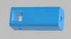
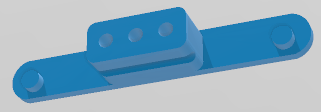

# Telefèric de Montjuïc
Maqueta Educativa del Teleféric de Montjuïc 

# Automats-Stemfie

Realitzat per [Jordi Mayné](https://github.com/maynej) des de Mechatronic Study jordi.mayne@mechatronicstudy.com 

L'objectiu es muntar-la en el [Fab de la Casa del Mig](https://www.fabcasadelmig.cat/)  

La documentació en llengua castellana es pot trobar en [PDF](https://github.com/maynej/CableCar-Montjuic/tree/main/DOC_ESP) 

## Cabines 
  
Descripció         | Imatge          | Arxius STL    
------------- | ------------- | ------------- 
Base Cabina | | [Base](STL/STL_Cabines/Base.stl) 
Bancs | | [Bancs](STL/STL_Cabines/Bancs_x2.stl)
Sostre Cabina | | [Sostre](STL/STL_Cabines/Sostre.stl) 
Topalls | | [Topalls](STL/STL_Cabines/Topall_x4.stl)
Suport ganxo | | [Suport](STL/STL_Cabines/SobreSostre.stl)
Perxa | | [Perxa](STL/STL_Cabines/Perxa.stl)

## Postes 
  
Descripció         | Imatge          | Arxius STL    
------------- | ------------- | ------------- 
Base Poste | | [Base Poste](STL/STL_Postes/BasePoste_x3.stl
Poste | | [Poste](STL/STL_Postes/Poste_x3.stl
Porta Politxes 1 | | [Porta Politxa 1](STL/STL_Postes/PortaPolitxes1_x6.stl
Porta Politxes 2 | | [Porta Politxa 2](STL/STL_Postes/PortaPolitxes2_x6.stl
SubPorta Politxes 1 | | [SubPorta Politxa 1](STL/STL_Postes/SubPortapolitxes2_x12.stl
SubPorta Politxes 2 | | [SubPorta Poltxa 2](STL/STL_Postes/SubPortapolitxes2_x12.stl

## Estacio Superior 
  
Descripció         | Imatge          | Arxius STL    
------------- | ------------- | ------------- 
 | | [Base](STL/STL_Postes/BasePoste_x3.stl

## Estacio Inferior 
  
Descripció         | Imatge          | Arxius STL    
------------- | ------------- | ------------- 
Motor | | [Base](STL/STL_Cabines/Base.stl) 

## Llicència

Creative Commons Attribution-NoComercial-ShareAlike 4.0 International (CC BY-NC-SA 4.0)  

## QR

