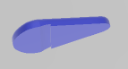

# Telefèric de Montjuïc
Maqueta Educativa del Teléric de Montjuïc 

# Automats-Stemfie

Realitzat per [Jordi Mayné](https://github.com/maynej) des de Mechatronic Study jordi.mayne@mechatronicstudy.com 

L'objectiu es muntar-la en el Fab de la Casa del Mig 

La documentació en llengua castellana es pot trobar en [PDF](https://github.com/maynej/CableCar-Montjuic/tree/main/DOC_ESP) 

## Propostes 
  
Descripció         | Imatge          | Arxiu PDF    
------------- | ------------- | ------------- 
Base Cabina | | [Base](STL/Base.STL) 
Bancs | | [Bancs](STL/Bancs_x2.STL)
Sostre Cabina | | [Sostre](STL/Sostre.STL) 
Topalls | | [Topalls](STL/Topalls_x4.STL)
Suport ganxo | | [Suport](STL/Suport.STL)
Perxa | | [Ganxo](STL/Perxa.STL)

## Llicència

Creative Commons Attribution-NoComercial-ShareAlike 4.0 International (CC BY-NC-SA 4.0)  

## QR

 <a href="https://www.codigos-qr.com/en/qr-code-generator/" target="_blank" id"qrgenerator">Qr Code Generator</a>

